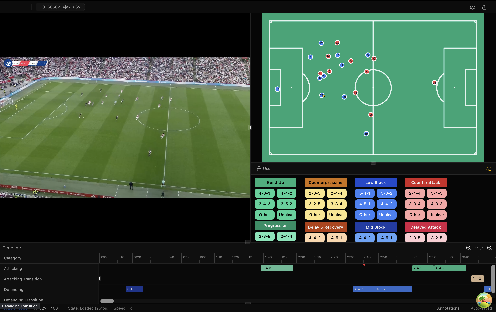

# DataballPro

**Sportwissenschaftliche Videoanalyse für den Fußball — Event-Annotation, Telestration in Broadcast-Qualität und Tracking-Daten in einer Desktop-Anwendung.**

[](https://github.com/ouyang1030/DataballPro/releases/latest)
[](https://github.com/ouyang1030/DataballPro/releases)
[](https://ouyang1030.github.io/DataballPro/)

[English](README.md) · [简体中文](README.zh-CN.md) · **Deutsch**

> Dieses Repository verteilt die veröffentlichten Builds. Der Quellcode der Anwendung wird in einem privaten Repository entwickelt.



---

## Download

Die aktuelle Version gibt es auf der Seite [**Releases**](https://github.com/ouyang1030/DataballPro/releases/latest).

| Plattform                   | Datei                                                                       | Voraussetzungen                                                             |
| --------------------------- | --------------------------------------------------------------------------- | --------------------------------------------------------------------------- |
| **macOS** (Apple Silicon)   | `DataballPro_<Version>_aarch64.dmg`                                         | macOS 13 Ventura oder neuer. Nur M1/M2/M3/M4 — Intel-Macs werden nicht unterstützt. |
| **Windows** (x64)           | `DataballPro_<Version>_x64-setup.exe` (Installer) oder `..._x64_en-US.msi`   | Windows 10 oder 11                                                          |
| **Linux** (x64)             | `DataballPro_<Version>_amd64.AppImage`                                      | glibc 2.38 oder neuer (Ubuntu 24.04+, Debian 13+, Fedora 39+)               |

### FFmpeg wird benötigt

DataballPro nutzt FFmpeg zum Dekodieren von Video, für Proxy-Dateien, Aufnahme und Export. Bitte vor der ersten Nutzung installieren:

```bash
# macOS
brew install ffmpeg

# Windows (PowerShell)
winget install Gyan.FFmpeg

# Debian / Ubuntu
sudo apt install ffmpeg
```

Die Anwendung durchsucht die üblichen Installationspfade sowie den `PATH`. Liegt FFmpeg an einer ungewöhnlichen Stelle, lässt sich der vollständige Pfad zur Binärdatei über die Umgebungsvariable `DATABALLPRO_FFMPEG` angeben.

Scheitert das Laden eines Videos mit einer Meldung über die Videoauflösung, liegt es fast immer an der FFmpeg-Installation — neu installieren (unter macOS `brew reinstall ffmpeg`) und die Anwendung neu starten.

---

## Erster Start

**macOS** — die Builds sind ad-hoc signiert und nicht notarisiert, deshalb verweigert Gatekeeper den ersten Start. Entweder mit Rechtsklick auf die App **Öffnen** wählen oder das Quarantäne-Attribut entfernen:

```bash
xattr -dr com.apple.quarantine /Applications/DataballPro.app
```

**Windows** — SmartScreen meldet eventuell „Der Computer wurde durch Windows geschützt". Auf **Weitere Informationen → Trotzdem ausführen** klicken.

**Linux** — das AppImage ausführbar machen und FUSE 2 nachinstallieren, falls die Distribution nur FUSE 3 mitbringt:

```bash
chmod +x DataballPro_*_amd64.AppImage
sudo apt install libfuse2t64      # Ubuntu 24.04+; ältere Versionen nutzen libfuse2
./DataballPro_*_amd64.AppImage
```

---

## Funktionen

### Video-Annotation

Framegenaues Springen und Einzelbildschritte, Wiedergabe von 0,25× bis 2,0× sowie ein Code Window, das von JSON-Kodierschemata gesteuert wird (Phasen → Unterphasen → Events/Formationen). Events lassen sich während der Wiedergabe per Tastenkürzel taggen und anschließend auf einer Timeline per Drag-and-drop nachbearbeiten.

### Telestration

Grafiken in Broadcast-Qualität direkt auf dem Clip: Pfeile, Halos, verbundene Ringe, Zonen, Formationsflächen, Manndeckungs-Linien, Sichtkegel, Messungen, Text und Timer. Effekte können getrackten Spielern folgen, Freeze-Frames fügen ein stehendes Segment in die Timeline ein, und alles lässt sich fest in den Videoexport einbrennen.

### Live-Aufzeichnung

Capture-Karte, Webcam oder Netzwerkstream (RTSP/HTTP) anbinden. Das native FFmpeg-Backend nimmt nach `.mp4` auf und liefert gleichzeitig eine latenzarme Vorschau — so lässt sich taggen, während das Spiel läuft, statt auf die fertige Datei zu warten.

### Tracking-Daten

Import von aufbereiteten CSV-Dateien (Metrica, databallpy), Opta F24/F7 + 25 Hz TRACAB sowie Opta Match XML + 10/25 Hz TGV, jeweils mit Preflight-Prüfung und Qualitätsvalidierung. Nach dem Abgleich der Tracking-Zeit mit der Videozeit (etwa über den Anstoß) zeigt die synchronisierte 2D-Taktikansicht Geschwindigkeitsspuren, Voronoi-Raumkontrolle, konvexe Hüllen, Mannschaftsschwerpunkte, phasenabhängige Formationserkennung und ein Deckungsnetz. Geschwindigkeit, Beschleunigung und Laufdistanz werden nativ berechnet.

### Analyse

Spieler-Heatmaps (2D-KDE mit einstellbarer Bandbreite), Sunburst- und Sankey-Darstellungen der Label-Verteilung und Ereignisfolgen, Ereignisverteilung auf einem schematischen Spielfeld sowie Interrater-Reliabilität (Cohens κ, Fleiss' κ mit Bootstrap-Konfidenzintervallen, Konfusionsmatrix, zeitliche IoU). Die fusionierten Datensätze — Video-Events, abgeleitete Annotationen und Tracking-Daten — lassen sich als CSV/JSON für die Weiterverarbeitung in Python oder R exportieren.

### KI-Unterstützung

Spielererkennung und -verfolgung sowie automatische Spielfeldkalibrierung. Alles läuft lokal auf dem eigenen Rechner — kein Konto, kein Upload, kein Netzwerkzugriff. Die erkannten Spieler lassen sich anschließend mit Telestration-Effekten verknüpfen.

### Oberfläche

Verfügbar auf Deutsch, English, 简体中文, Español, Français, 日本語, 한국어 und العربية (mit RTL-Layout).

---

## Dokumentation

Das [**Help Center**](https://ouyang1030.github.io/DataballPro/) (englischsprachig) deckt den kompletten Arbeitsablauf ab:

- [Erste Schritte](https://ouyang1030.github.io/DataballPro/fundamentals/getting-started/) — ein Projekt aus einer Videodatei oder einer Live-Quelle anlegen
- [Arbeitsbereich](https://ouyang1030.github.io/DataballPro/fundamentals/workspace/) und [Videowiedergabe](https://ouyang1030.github.io/DataballPro/fundamentals/video-playback/)
- [Code Window](https://ouyang1030.github.io/DataballPro/annotation/code-window/), [Annotieren](https://ouyang1030.github.io/DataballPro/annotation/annotating/), [Timeline-Bearbeitung](https://ouyang1030.github.io/DataballPro/annotation/timeline/)
- [Effektbibliothek](https://ouyang1030.github.io/DataballPro/telestration/effects/), [Spieler-Tracking](https://ouyang1030.github.io/DataballPro/telestration/player-tracking/), [Freeze-Frames](https://ouyang1030.github.io/DataballPro/telestration/freeze-frame/)
- [Tracking-Daten importieren](https://ouyang1030.github.io/DataballPro/tracking/importing/) und das [2D-Spielfeldpanel](https://ouyang1030.github.io/DataballPro/tracking/pitch-panel/)
- [Analysewerkzeuge](https://ouyang1030.github.io/DataballPro/analysis/tools/) und [Export](https://ouyang1030.github.io/DataballPro/sharing/export/)
- Referenz: [Tastenkürzel](https://ouyang1030.github.io/DataballPro/reference/keyboard-shortcuts/), [CSV-Format](https://ouyang1030.github.io/DataballPro/reference/csv-format/), [Einstellungen](https://ouyang1030.github.io/DataballPro/reference/preferences/)

---

## Updates

DataballPro prüft die Releases dieses Repositories auf Updates und installiert sie auf Wunsch direkt — manuell herunterladen muss man also nur einmal.

## Ihre Daten

Projekte sind gewöhnliche Ordner auf der Festplatte: eine SQLite-Datenbank mit den Annotationen plus Konfigurationsdateien neben dem Video. Nichts wird hochgeladen — die Anwendung geht nur für die Update-Prüfung und für selbst konfigurierte Stream-URLs ins Netz.

## Probleme melden

Bitte ein [Issue](https://github.com/ouyang1030/DataballPro/issues) eröffnen, mit Betriebssystem und App-Version, dem durchgeführten Schritt und dem beobachteten Verhalten. Die Logdatei anzuhängen hilft sehr:

- macOS: `~/Library/Logs/com.databallpro.app/`
- Windows: `%APPDATA%\com.databallpro.app\logs\`
- Linux: `~/.local/share/com.databallpro.app/logs/`

## Lizenz

DataballPro steht unter der [PolyForm Noncommercial License 1.0.0](LICENSE): kostenlos nutzbar für Forschung, Lehre, private Projekte und jeden anderen nichtkommerziellen Zweck — Hochschulen und öffentliche Forschungseinrichtungen eingeschlossen. Für kommerzielle Nutzung ist eine gesonderte Lizenz nötig; bitte per Issue Kontakt aufnehmen.

Mitgelieferte Komponenten, einschließlich der ONNX-Modellgewichte, unterliegen eigenen Bedingungen — siehe [THIRD_PARTY_NOTICES.md](THIRD_PARTY_NOTICES.md).
